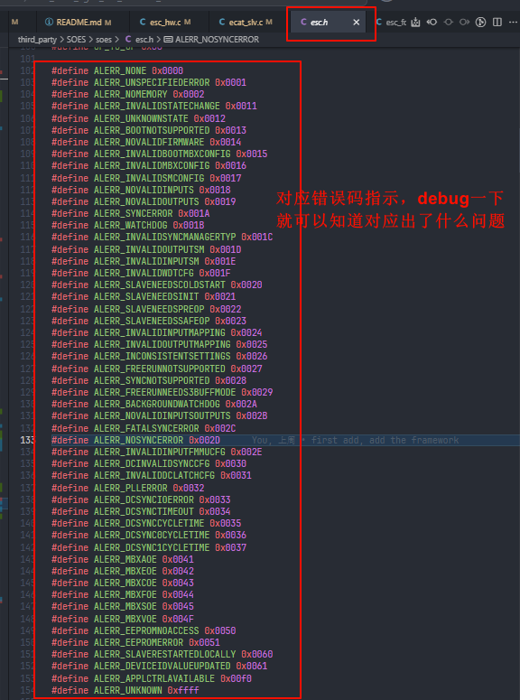
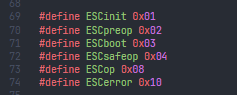

# 简单ecat从站的尝试
- **main** 分支是开发分支
- **onlyDJI_f407zgt6** 分支是只包含适配DJI电机的分支
- **swerve_HAL_f407zgt6** 分支是HAL库适配当前舵轮底盘从站板的分支（can1 舵向2006，can2 轮向vesc + 3io）
- **swerve_LL_f407zgt6** 分支是LL库版本的舵轮底盘从站板
- **sync_ecat_test** 分支是测试同步ecat的分支（可以在多从站之间进行同步）

# 记录一些开发debug方法：
1. 检查思路：**查看关键变量**，查看报错信息，通过查阅Ethercat文档，对症下药！切忌盲目修改代码
  关键变量： 
  - **ESCvar.ALevent** 主站事件指示
  - **ESCvar.ALerror** 错误码指示
  
  - **ESCvar.ALstatus** 从站状态指示
  
2. **Ethercat协议栈相关**：
  - 注意Ethercat协议栈中将运行一个内置的状态机，它将具有以下状态：
    - **INIT**：初始化状态
    - **BOOT**：引导状态
    - **PREOP**：预运行状态
    - **SAFEOP**：安全运行状态
    - **OP**：运行状态
    需要注意以下内容：
    - 在**INIT**状态下，不可以进行任何PDO、SDO通信；
    - **PRE-OP** 状态下，可以进行SDO通信，主站可以读出从站信息，从站也读出主站配置到从站的内容，但是不可以进行PDO通信；
    - **SAFE-OP** 状态下，可以进行TxPDO 通信（从站向主站发送PDO），但是不可以进行RxPDO通信（主站向从站发送PDO，会输出SAFF值（由用户自定义，对应ecat_app中的_safeoutput_callback内容））（当然可以进行SDO通信）；
    - **OP** 状态下，可以进行TxPDO和RxPDO通信（当然可以进行SDO通信，但是不推荐在这个过程中去进行SDO通信，防止参数修改导致系统异常，如果在进入了OP状态之后还需要用SDO进行配置的话，需要先在主站请求从站进入SAFE-OP状态，进行完SDO通信时，再次申请进入OP状态即可）；
3. **看门狗时间设置原理**：
  - 从站本地会运行一个看门狗，用于**监测是否掉线（与主站失去通讯）**
  - 该值在初始化时传入
  - watchdog 并非以物理时间进行直接计数，而是每次调用DIG_process(DIG_PROCESS_WD_FLAG)时减1
    在执行DIG_process(DIG_PROCESS_OUTPUTS_FLAG ) 将会重装载watchdog_cnt的值，表示从站正常运行
  - 当watchdog<=0且从站切换到允许PDO输出的运行态（Safe-OP）时，就判定为超时，这时 从站将会掉入SAFE-OP+ERROR状态
  - 典型配置下，。DIG_process(DIG_PROCESS_WD_FLAG)会随着SM2中断周期调用一次；若SM2周期是1ms，那么watchdog_cnt的单位就相当于毫秒；我们通常也是判定如果主站不能向从站进行输出为失联状态，那么喂狗操作就只会在SM2中断中进行
  - 出过的一个bug，主站启动时间较久，导致从站在OP状态时，还未有数据到达从站（主站运行在1khz，也即1ms的喂狗），此时从站watchdog重装载值设置为200（也即0.2ms，间隔过短！导致从站误认为自己掉线了），从站掉入SAFE-OP+ERROR状态，主站无法进行PDO通信，导致主从站无法进入OP状态
  > 当时抽象的表现是：debug暂停程序运行一段时间，卡一卡，就成功进入OP了(
4. **DC同步时钟设置**
  DC同步时钟可以开启多从站之间的同步，通常在多从站的应用中使用
  - DC同步时钟的设置需要在主站和从站都进行配置
    - 从站基本无需修改
    - 主站需要加入几行代码，无伤大雅
  - 但是**需要保证：拷贝数据的时间需要小于DC同步时钟的周期的一半，否则会导致sync0 pdi信号的丢失** 
5. can控制器相关
   - can总线在本项目开发中属于相对困难开发的点，由于其在具体使用中出现许多平时从未遇到的问题，而这些问题通常在单以stm32作为主控时被忽略（复位大法），然而在ethercat主从站开发中，从站稳定的运行是地基，否则即使主站正常运行，执行器也无法完成对应任务
   - 因此本项目采样许多防范措施，并且测试了极限的can控制器性能
6. 主程序与中断程序的交互(裸机版本,由于没有信号量等机制)
   - 在中断程序中使用原子操作，避免中断程序与主程序之间的冲突 
   ```cpp
    #define LOCKED 1
    #define UNLOCKED 0

    uint8_t Sys_IsLocked(volatile uint8_t* lock){
      return __LDREXB(lock);
    }

    uint8_t Sys_GetLock(volatile uint8_t* lock,uint32_t timeout_ms){
      uint32_t st_ms = HAL_GetTick();
      int status;
      do{
        if ((HAL_GetTick() - st_ms) > timeout_ms) return 0;  // 超时失败
        status = __LDREXB(lock);  // 独占读取
      }while(status == LOCKED || __STREXB(lock, LOCKED) ); // 已锁定或写入失败则重试
      return 1; // 成功获取锁
    }

    uint8_t Sys_GetLockOnce(volatile uint8_t* lock){
      int status = __LDREXB(lock);
      if(status == LOCKED) return 0;
      return (!__STREXB(lock, LOCKED)); // 成功获取锁
    }

    // 释放锁
    void Sys_FreeLock(volatile uint8_t* lock){
      *lock = UNLOCKED; // 直接写入解锁状态
    }
    ```

7. 使用DWT对程序运行周期进行测量:
  ```cpp
  uint32_t start = DWT->CYCCNT;
  float dt_s;
  // main loop code

  dt_s = DWT_GetDeltaT(&start); // dt_s为秒
  ```